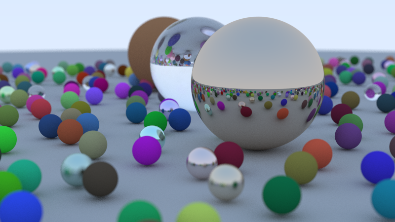

# 들어가며




``` txt
var cam = Camera.init(16.0 / 9.0, 800);
cam.samples_per_pixel = 400;
cam.max_depth         = 50;
cam.vfov              = 20;
cam.lookfrom          = point3.init(13, 2, 3);
cam.lookat            = point3.init(0, 0, 0);
cam.vup               = vec3.init(0, 1, 0);
cam.defocus_angle     = 0.6;
cam.focus_dist        = 10.0;

Measure-Command { .\ch14_thread\out\windows-x86_64-ReleaseFast\OneWeekend.exe > image.bmp }
Days              : 0
Hours             : 0
Minutes           : 2
Seconds           : 20
Milliseconds      : 522
Ticks             : 1405224153
TotalDays         : 0.00162641684375
TotalHours        : 0.03903400425
TotalMinutes      : 2.342040255
TotalSeconds      : 140.5224153
TotalMilliseconds : 140522.4153
```